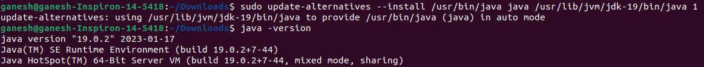

# Installing JDK-19 in Ubuntu 22.04

## 1. Installing the jdk-19 debian package from the official website of oracle jdk downloads page.

  
Click on Java Downloads  

  
Click on the link next to x64 Debian Package for Ubuntu.  
Your JDK will be downloaded.  

## 2. Installing process in terminal
Open terminal in your downloads directory and type the following:  
1. `sudo dpkg -i jdk-19_linux-x64_bin.deb` : Unpacking the JDK file.    
  

- If encountered an error like this :   
  
then the solution is to type `sudo apt --fix-broken install` and then unpack debian package   again. The error will get solved.  

2. `ls /usr/lib/jvm` : to check jdk installation.  
  

3. `sudo update-alternatives --install /usr/bin/java java /usr/lib/jvm/jdk-19/bin/java 1` : to install java and then check the installatin of java by typing `java -version`. 
  

4. `sudo update-alternatives --install /usr/bin/javac javac /usr/lib/jvm/jdk-19/bin/javac 1` : to install javac and then check the installatin of javac by typing `javac -version`. 
  

5. `sudo update-alternatives --config java` : to update and then copy this `/usr/lib/jvm/jdk-19/bin/java` which will be used further.  
  

6. `sudo gedit /etc/environment`  
  
After entering the password a text editor window will open like this:  
  
In this write this `JAVA_HOME="/usr/lib/jvm/jdk-19"` in the second/ last line and then save it and close the window.  
  

7. `source /etc/environment` then press enter.  

8. `echo $JAVA_HOME` then press enter.  
  

9. Congratulations! You've installed JDK-19 successfully in your Ubuntu 22.04 system.   

